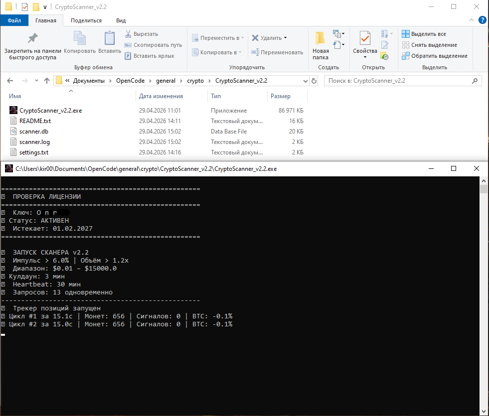
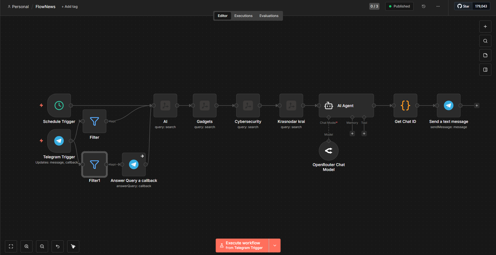
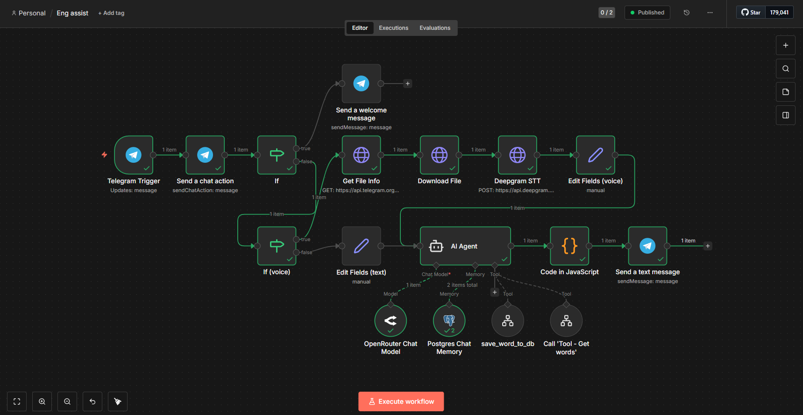

# 🤖 AI Projects by Kirill Reiki

**AI-разработчик × Психолог × n8n Automation**
📍 Анапа | Telegram: [@kir029](https://t.me/kir029)

---

## 🎯 Обо мне

Создаю AI-решения для автоматизации бизнеса и личных задач. 
Сочетаю технический подход с пониманием человеческой психологии.

**Направления:**
- 🤖 Telegram-боты под ключ
- ⚙️ Автоматизация процессов (n8n)
- 🧠 Психологические услуги (авторский NET-метод)

---

## 📁 Проекты

### 1. 💰 Crypto Bot
**Задача:** Автоматическое отслеживание цен криптовалют, их движения (резкие скачки роста/падения)

**Что делает:**
- Парсит данные из ByBit API
- Сохраняет историю в Google Sheets
- Отправляет уведомления в Telegram при найденном сигнале (отбор по строгим критериям)

**Технологии:** Python, Google Sheets API, Telegram Bot API, компилляция в .exe (запускается локально)

**Статус:** 🔒 Commercial (продается)

---

### 2. 📰 News Bot
**Задача:** Автоматическая публикация новостей в Telegram-канал

**Что делает:**
- Собирает новости из RSS-лент (Tavily) и API
- Фильтрует по ключевым словам
- Форматирует и публикует посты

**Технологии:** n8n, RSS Parser/Tavily, Telegram Bot API

**Статус:** ✅ Готов к использованию

---

### 3. 🤖 English AI Assistant
**Задача:** Помощь в изучении английского языка через AI

**Что делает:**
- Чат-бот для практики разговорного языка
- Проверка грамматики и лексики
- Персональные упражнения по запросу
- Ежедневные уведомления с мини-заданием
- Общение с помощью голосовых сообщений

**Технологии:** n8n, OpenAI API, Supabase, Deepgram API, Telegram Bot API

**Статус:** ✅ Работает

---

## 🛠 Технический стек

| Инструмент | Назначение |
|------------|------------|
| **n8n** | Workflow automation |
| **Telegram Bot API** | Уведомления и чаты |
| **Supabase** | Хранение данных |
| **OpenAI / LLM** | AI-интеграции |
| **Deepgram API** | Speech To Text (STT) |
| **REST API** | Внешние сервисы |

---

## 🧠 Психологические услуги

Параллельно развиваю авторский метод **NET (Neuro-Energy Transformation)** — работа на 4 уровнях: Тело, Психика, Разум, Энергия.

📩 Запись на консультацию: [@kir029](https://t.me/kir029)

---

## 📬 Контакты

| Канал | Ссылка |
|-------|--------|
| Telegram | [@kir029](https://t.me/kir029) |
| GitHub | [github.com/Kir0029](https://github.com/Kir0029) |

---

> 💡 Открыт к предложениям по разработке и сотрудничеству. Пишите!
