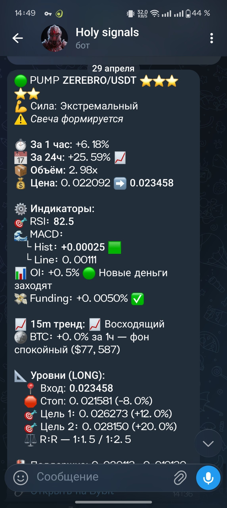
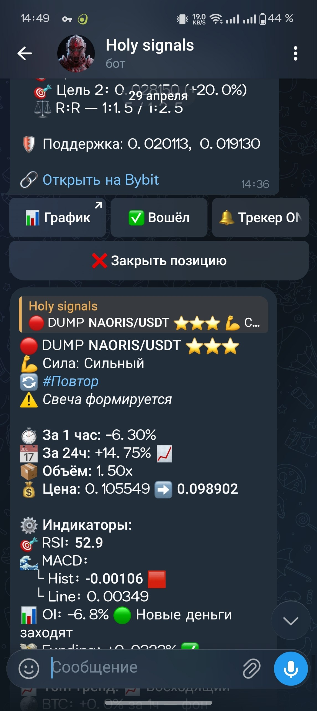
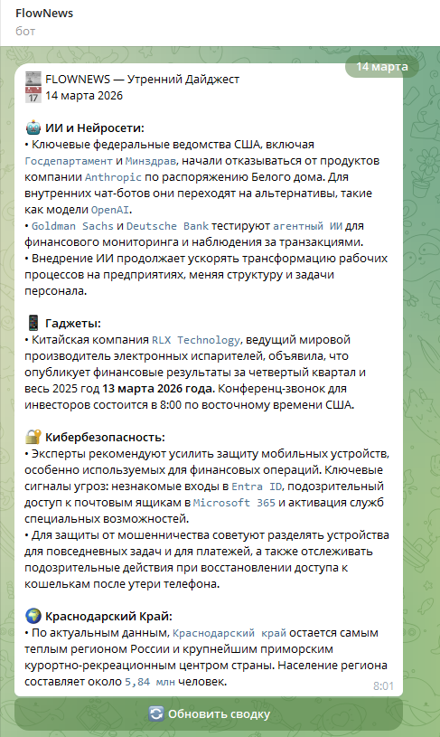
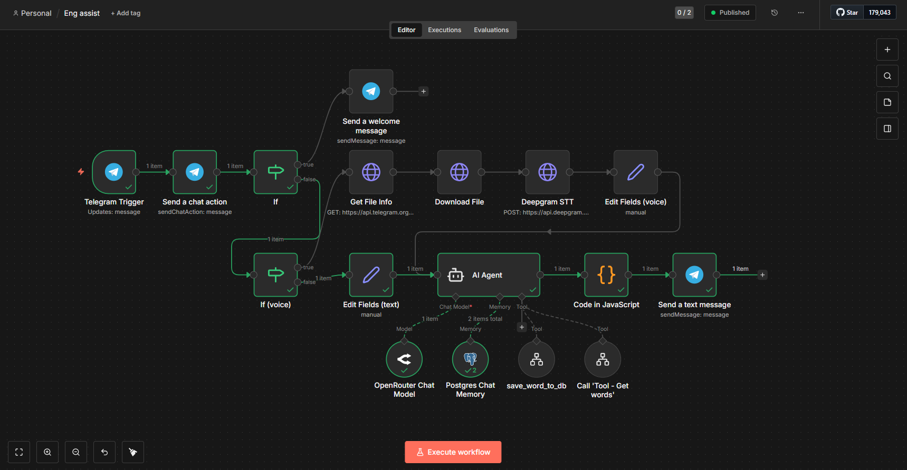

# 🤖 AI Projects by Kirill Kiselev.

**AI-Engineer × Jynior Python Developer**
📍 Анапа | Telegram: [@kir029](https://t.me/kir029)

---

## 🎯 Обо мне

AI Engineer с бэкграундом в аналитике и безопасности. Создаю автономных ИИ-агентов на n8n/Make + LLM, которые экономят время бизнеса и работают с данными безопасно (self-hosted), а также AI решения на Python.
Ключевая ценность: соединяю техническую реализацию (Python, API, Docker) с пониманием психологии пользователя — боты не просто «отвечают», а ведут диалог, удерживают контекст и адаптируются.

🔑 Ключевые навыки:
Автоматизация и оркестрация:
• Python (основной): скрипты, парсинг, API-интеграции, автоматизация, PyInstaller

• JavaScript (базовый): n8n Function-ноды, работа с JSON

• SQL (базовый): PostgreSQL, Supabase

• OpenCode CLI: использование для генерации кода, создания утилит, управления 5 специализированными агентами с контекстным переключением (No-Code)

AI / LLM / RAG:
• OpenAI API, OpenRouter, Prompt Engineering, System Prompts, и другие модели

• RAG-архитектура: векторные таблицы, долгосрочная память (>360 дней), контекстное удержание

• Настройка поведения агентов под пользователя

Разработка и интеграции:
• n8n (self-hosted через Docker) — оркестрация workflow

• REST API, Webhooks, JSON, GraphQL

• Telegram Bot API, Google Sheets API, ByBit API

• Парсинг данных: BeautifulSoup, requests, RSS

• Python (средний): скрипты, парсинг, упаковка в .exe (PyInstaller), работа с API

Инфраструктура и DevOps:
• Docker, self-hosted развертывание, безопасное хранение API-ключей

• OSINT-анализ, оценка рисков, информационная безопасность

• Git, GitHub, GitLab

• Linux CLI, bash-скрипты

• CI/CD (базовый)

Софт-скиллы:
• Аналитическое мышление, декомпозиция сложных задач, работа с неполными данными

• Декомпозиция сложных задач

• Стрессоустойчивость (5 лет в условиях высокой ответственности)

• Быстрая обучаемость: погружение в новые технологии за 1-2 недели

---

## 📁 Проекты

### 1. 💰 Crypto Bot
**Задача:** Автоматическое отслеживание цен криптовалют, их движения (резкие скачки роста/падения)

Стек: Python, Bybit API, Telegram API, SQLite, Asyncio, PyInstaller
• Создал аналитического бота для мониторинга волатильности и объёмов на Bybit в реальном времени — сканирует 650+ USDT-пар
• Мультитаймфрейм анализ (1H + 15M + 4H): RSI, MACD, EMA20/50, ATR, уровни поддержки/сопротивления, Open Interest, BTC-контекст
• Скоринг сигналов 1-5⭐ по 7 факторам
• Мгновенные алерты в Telegram с inline-кнопками: вход по ссылке, трекинг TP1/TP2/Stop, ручное закрытие
• Полный цикл сканирования: ~20 секунд
• Две версии: Локальная (.exe): SQLite БД, трекер позиций, лицензирование через Google Sheets, настраиваемое плечо. Серверная (Ubuntu VPS): 24/7 через systemd, без БД, конфиг через .env
• Упаковка в .exe: автономная работа на Windows без установки Python/зависимостей

**Статус:** 🔒 Commercial (продается)

---

### 2. 📰 News Bot
**Задача:** Автоматическая публикация новостей в Telegram

Стек: n8n, RSS/парсинг, LLM-суммаризация, cron, Telegram
• Автоматизировал сбор новостей из 100+ источников по заданным темам (AI, финансы, технологии)
• Настроил LLM-суммаризацию: выделение сути, удаление «шума», структурирование по приоритетам
• Ежедневная рассылка в Telegram в 08:00 без участия человека
• Результат: Сокращение времени на поиск/чтение новостей на ~70%, экономия ~45 минут в день (минимум)

**Статус:** ✅ Работает ежедневно

---

### 3. 🤖 English AI Assistant
**Задача:** Помощь в изучении английского языка через AI

Стек: n8n (self-hosted), OpenAI API, Google Sheets, Telegram Bot API, RAG, Supabase
• Разработал ИИ-агента с архитектурой RAG: память диалога >360 дней, точность ответов ~97%
• Настроил авто-исправление ошибок + объяснение правил с адаптацией под уровень пользователя
• Интегрировал с Supabase: автоматическое сохранение прогресса, статистика, повторение слов
• Результат: 8+ тестовых пользователей, улучшение усвоения материала на ~15%
• Добавил возможность обработки голосовых сообщений

**Статус:** ✅ Работает постоянно

---

## 🛠 Технический стек

| Инструмент | Назначение |
|------------|------------|
| **n8n** | Workflow automation |
| **Telegram Bot API** | Уведомления и чаты |
| **Supabase** | Хранение данных |
| **OpenAI / LLM** | AI-интеграции |
| **Deepgram API** | Speech To Text (STT) |
| **REST API** | Внешние сервисы |

## 🛠 Технологии

**Backend:** Python, REST API, Webhooks, JSON, PostgreSQL, Supabase, SQLite
**AI/LLM:** OpenAI API, OpenRouter, RAG, embeddings, Prompt Engineering
**DevOps:** Docker, Git, Linux CLI, self-hosted deployment, CI/CD (базовый)
**Testing:** pytest (базовый), отладка AI-агентов, логирование

---

## 📬 Контакты

| Канал | Ссылка |
|-------|--------|
| Telegram | [@kir029](https://t.me/kir029) |
| GitHub | [github.com/Kir0029](https://github.com/Kir0029) |

---

> 💡 Открыт к предложениям по разработке и сотрудничеству. Пишите!
